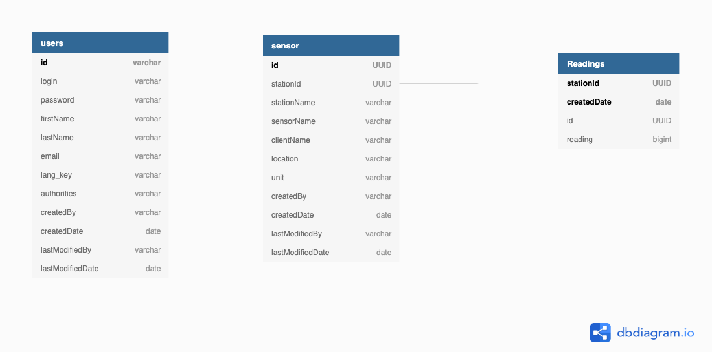

# IOT Analyzer Application

This application helps to process the IOT data and store it in DB. User can use the endpoint provided to fetch the Average,
Max,Min and Median value of the Sensor readings for given time frame.

# Tech Stack
1. Java 8
2. Spring Boot
3. Reactive Spring - For Simulating data
4. Cassandra
5. Docker
6. Maven
7. JWT Security

#Approach

Reactive Spring will simulate data for Thermostat, Fuel Reader, Hear Rate Monitor Sensor for every second. Consumer will listen to the producer URI and store the 
 data to the table.Table Sensor will hold the Sensor details along with the StationId for which the readings will be stored in the Readings Table to calculate the 
Avg/Max/Min and Median for the given time range. JWT security used for authenticating the user to access the endpoints.


#Table Structure


User:
To make it simple for prototype i have used 3 tables which are shown in the image. User table will hold the User details along with the authorities. 
Implementation based on the authorities is not implemented , it will be taken as a future task.
Sensor:
Sensor table will hold the Sensor details along with the Stationid, location and unit. Sensorid(Id) configured as primarykey to hold the unique 
sensor device. In Future we can make Stationid and clientname as primary key along with id(to be made as unique for each type of Sensor)so that each 
client can have only one unique sensor record, but many stations for which we can store the data in Readings table.
Readings:
Readings table will hold the reading value of each stationid. So in future even if station table structure is changed values can retrieved using stationid.
Composite Primary key createddate(Clustered) and stationid (partitioned).
 * Partition Key is responsible for data distribution across your nodes.
 * Clustering Key is responsible for data sorting within the partition.
 
#DB Setup
Perquisites: Please make sure that Cassandra is installed in your machine where this application is going to be ran.
Keyspace creation and Table creation will be done automatically each time on start of the application. I configured schema-action as recreate_drop_unused by
default in application.yml file. Please check application.yml file for the cassandra configuration.
For Mac Users , after installation
Execute the below cmd in terminal to find the path. Example: /usr/local/bin/cassandra
```
which cassandra
```
Traverse to /usr/local path and execute cqlsh to open the cassandra db
```$xslt
cqlsh
```
Now you can see terminal with cqlsh:> after this type your keyspace(relay) to check the table values and query the data
```$xslt
   use relay
```
##Reactive Spring
Spring WebFlux internally uses Project Reactor and its publisher implementations – Flux and Mono. We can achieve Publisher/Consumer concept
using Spring Reactive. Configured 3 publisher(HearRateMeter/FuelReader/Thermostat) which will produce value for each second. Consumer will listen to the
publisher to receive the value and store it in the table.

#Run Scripts
**Build Application**
For Building the application execute the build.sh file which is located in iot-analyzer/scripts folder. From the terminal run the below cmd
```
./scripts/build.sh

```
**Test Execution**
For running the test case execute the runtest.sh file which is located in iot-analyzer/scripts folder. From the terminal run the below cmd

```
./scripts/runtest.sh

```
**Start Server**
For starting the server goto scripts path execute the run.sh file which is located in iot-analyzer/scripts folder. From the terminal run the below cmd
```
cd scripts
./run.sh

```

Server will be started at port: 5678 . You can change the port number in application.yml if required.
```$xslt
server:
  port: 5678
```

Make a POST request to `/authroize` with the default admin user we loaded from user.csv file on application startup.

```
  $  curl --header "Content-Type: application/json" \
      --request POST \
      --data '{"username":"admin","password":"admin"}' \
      http://localhost:5678/authenticate

```

Add the JWT token you got with the above curl command as a Header parameter and make the call to get the average/max/min and median of the sensor. 
Below are the sample curl commands for different sensor. 

```$xslt
 curl --header "Content-Type: application/json"\
       --header "Authorization: Bearer <JWT_TOKEN>" \
      --request POST \
      --data ' {"fromTime":"2020-06-27T19:54:59.00Z","toTime":"2020-06-27T20:10:59.00Z","producerType":"FUELREADER"}' \
      http://localhost:5678/relay42/iot/avg

 curl --header "Content-Type: application/json"\
       --header "Authorization: Bearer <JWT_TOKEN>" \
      --request POST \
      --data ' {"fromTime":"2020-06-27T19:54:59.00Z","toTime":"2020-06-27T20:10:59.00Z","producerType":"THERMOSTAT"}' \
      http://localhost:5678/relay42/iot/max

 curl --header "Content-Type: application/json"\
       --header "Authorization: Bearer <JWT_TOKEN>" \
      --request POST \
      --data ' {"fromTime":"2020-06-27T19:54:59.00Z","toTime":"2020-06-27T20:10:59.00Z","producerType":"FUELREADER"}' \
      http://localhost:5678/relay42/iot/min

 curl --header "Content-Type: application/json"\
       --header "Authorization: Bearer <JWT_TOKEN>" \
      --request POST \
      --data ' {"fromTime":"2020-06-27T19:54:59.00Z","toTime":"2020-06-27T20:10:59.00Z","producerType":"HEARTRATEMETER"}' \
      http://localhost:5678/relay42/iot/median
```
### Code quality

Sonar is used to analyse code quality. You can start a local Sonar server (accessible on http://localhost:9001) with:

```
docker-compose -f src/main/docker/sonar.yml up -d
```

## Using Docker to simplify development (optional)

You can use Docker to start your application. A number of docker-compose configuration are available in the [src/main/docker](src/main/docker) folder to launch required third party services.

For example, to start a cassandra database in a docker container, run:

    docker-compose -f src/main/docker/cassandra.yml up -d

To stop it and remove the container, run:

    docker-compose -f src/main/docker/cassandra.yml down

You can also fully dockerize your application and all the services that it depends on.
To achieve this, first build a docker image of your app by running:

    ./mvnw -Pprod verify jib:dockerBuild

Then run:

    docker-compose -f src/main/docker/app.yml up -d